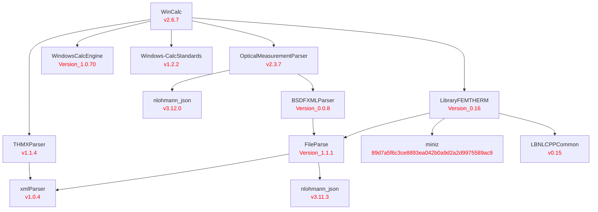

```mermaid
graph TD
    %% Level 0
    WinCalc[WinCalc<br/><font color='red'>v2.6.7</font>]

    %% Level 1 - direct dependencies
    OpticalMeasurementParser[OpticalMeasurementParser<br/><font color='red'>v2.3.7</font>]
    THMXParser[THMXParser<br/><font color='red'>v1.1.4</font>]
    WindowsCalcEngine[WindowsCalcEngine<br/><font color='red'>Version_1.0.70</font>]
    Windows-CalcStandards[Windows-CalcStandards<br/><font color='red'>v1.2.2</font>]
    LibraryFEMTHERM[LibraryFEMTHERM<br/><font color='red'>Version_0.16</font>]

    %% Level 2
    nlohmann_omp[nlohmann_json<br/><font color='red'>v3.12.0</font>]
    BSDFXMLParser[BSDFXMLParser<br/><font color='red'>Version_0.0.8</font>]
    FileParse[FileParse<br/><font color='red'>Version_1.1.1</font>]
    miniz[miniz<br/><font color='red'>89d7a5f6c3ce8893ea042b0a9d2a2d9975589ac9</font>]
    LBNLCPPCommon[LBNLCPPCommon<br/><font color='red'>v0.15</font>]

    %% Level 3
    xmlParser[xmlParser<br/><font color='red'>v1.0.4</font>]
    nlohmann_fp[nlohmann_json<br/><font color='red'>v3.11.3</font>]

    %% WinCalc dependencies
    WinCalc --> OpticalMeasurementParser
    WinCalc --> THMXParser
    WinCalc --> WindowsCalcEngine
    WinCalc --> Windows-CalcStandards
    WinCalc --> LibraryFEMTHERM

    %% OpticalMeasurementParser dependencies
    OpticalMeasurementParser --> nlohmann_omp
    OpticalMeasurementParser --> BSDFXMLParser

    %% LibraryFEMTHERM dependencies
    LibraryFEMTHERM --> FileParse
    LibraryFEMTHERM --> miniz
    LibraryFEMTHERM --> LBNLCPPCommon

    %% BSDFXMLParser dependencies
    BSDFXMLParser --> FileParse

    %% FileParse dependencies
    FileParse --> xmlParser
    FileParse --> nlohmann_fp

    %% THMXParser dependencies
    THMXParser --> xmlParser
```
